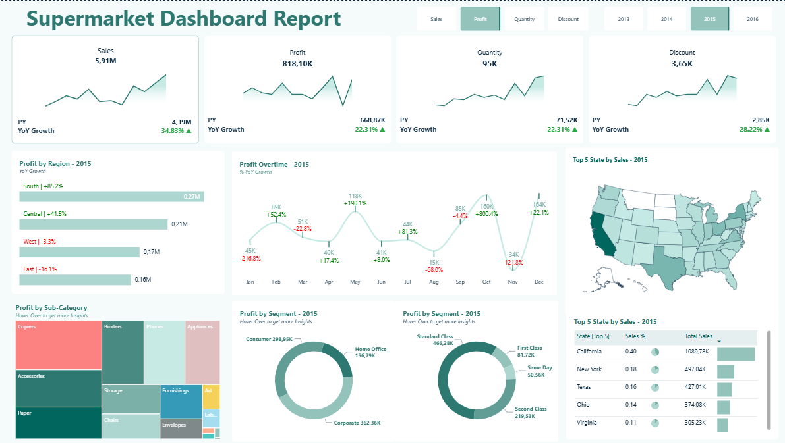

EN - English Description

This is an interactive Power BI dashboard built using Kaggle’s Supermarket Sales dataset.
The project focuses on analyzing sales, profit, discount, and quantity performance across multiple dimensions while combining data modeling, DAX measures, and visualization techniques.

<p align="center">
  
</p>

<p align="center">
 📊 Data Source: <a href="https://www.kaggle.com/datasets/wellkilo/supermarket-dataset" target="_blank">Kaggle - Supermarket_Dataset</a>
</p>

---
### 🎯 Overview

**Data Source:** Kaggle Supermarket Sales Dataset

**Tool:** Microsoft Power BI Desktop

**Modeling**: Split into dimension and fact tables in Power Query

**Date Table:** Created dynamically using DAX

**Measures:** Dynamic KPIs and YoY (Year-over-Year) performance metrics

**Theme:** Applied a pre-defined color palette for visual consistency

**Navigation:** Dynamic filtering by year and metric (Sales, Profit, Quantity, Discount)

### 📊 Dashboard Features

Sales, profit, and discount performance by year

Regional analysis with Top 5 States by Sales

Sales breakdown by Segment and Sub-Category

Trend visualizations using KPI cards and sparklines

Interactive tooltips, dynamic titles, and visual filters

DAX-powered dynamic visuals and calculations


### 🧠 Key Learnings

During this project:

* Strengthened my understanding of Power Query data modeling,

* Built dynamic KPIs and parameterized measures using DAX,

* Applied Power BI visualization design principles for clarity and interactivity.


### 📁 Project Structure

```
📁 supermarket-powerbi-dashboard/
│
├── 📁 pbip/
│   ├── 📁 assets/
│   ├── 📁 data/
│   ├── 📁 supermarket.Report/
│   ├── 📁 supermarket.SemanticModel/
│   └── supermarket.pbip
│
└── README.md
```
---

TR - Türkçe Açıklama

Bu proje, Kaggle’dan alınan süpermarket satış verilerini kullanarak oluşturduğum etkileşimli bir Power BI satış performansı dashboard’ıdır.
Amacım, satış, kâr, indirim ve ürün performanslarını farklı boyutlarda analiz etmek ve DAX + Power Query + görselleştirme süreçlerini tek bir çalışmada birleştirmekti.

---

### 🎯 Proje Özeti

**Veri kaynağı:** Kaggle Supermarket Sales Dataset

**Araç:** Microsoft Power BI Desktop

**Modelleme:** Power Query ile veriyi temizleyip boyut (Dim) ve fakt (Fact) tablolara ayırdım.

**DimDate tablosu:** DAX ile dinamik tarih tablosu oluşturdum.

**Ölçüler:** Dinamik measure’lar, KPI kartları ve YoY (Year-over-Year) analizleri tasarladım.

**Tema:** Hazır Power BI teması kullanarak renk tutarlılığı sağladım.

**Navigasyon:** Dönem (2013–2016) ve metrik (Sales, Profit, Quantity, Discount) bazlı dinamik filtreleme.

### 📊 Dashboard Özellikleri

Satış, kâr, miktar ve indirim performansının yıllara göre değişimi

Top 5 State by Sales haritası ile bölgesel analiz

Segment ve Sub-Category bazında satış dağılımları

YoY Growth, KPI ve küçük çizgi grafiklerle (sparkline) trend gösterimi

Tooltips, dinamik başlıklar ve etkileşimli filtreler

DAX ile oluşturulmuş dinamik görseller ve metrik kartları

### 🧠 Öğrendiklerim

Bu proje boyunca:

* Power Query’de veri modelleme ve ilişkilendirme adımlarını pekiştirdim,

* DAX ile dinamik KPI ve parametrik measure oluşturmayı öğrendim,

* Görselleştirme ve kullanıcı etkileşimi açısından Power BI tasarım prensiplerini uyguladım.

### 📁 Proje Dosya Yapısı
```
📁 supermarket-powerbi-dashboard/
│
├── 📁 pbip/
│   ├── 📁 assets/
│   ├── 📁 data/
│   ├── 📁 supermarket.Report/
│   ├── 📁 supermarket.SemanticModel/
│   └── supermarket.pbip
│
└── README.md
```
